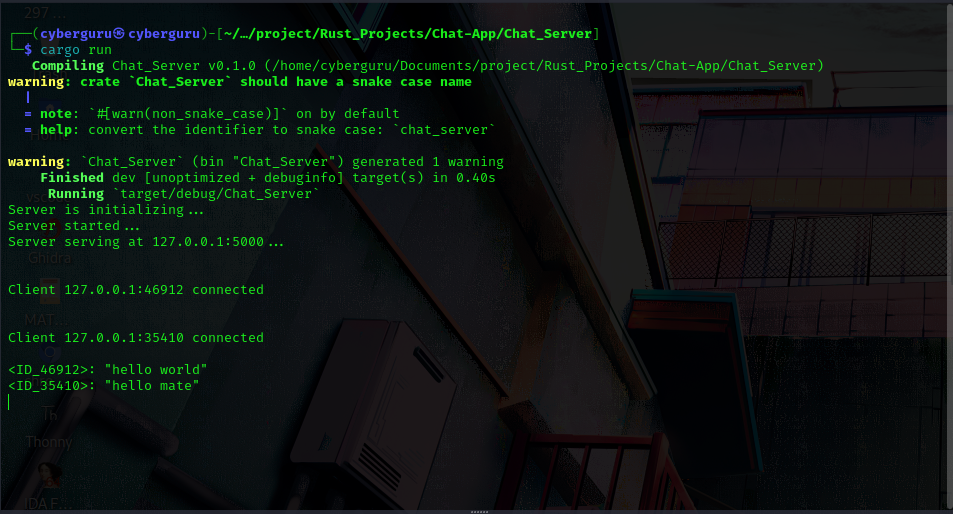
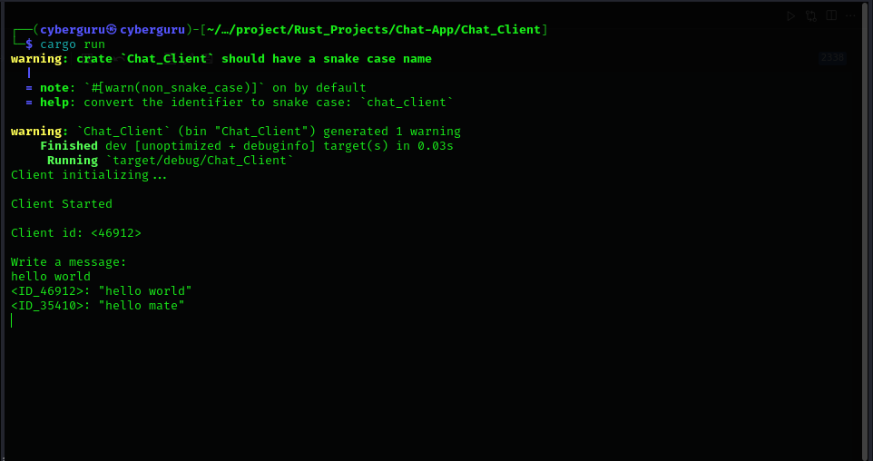
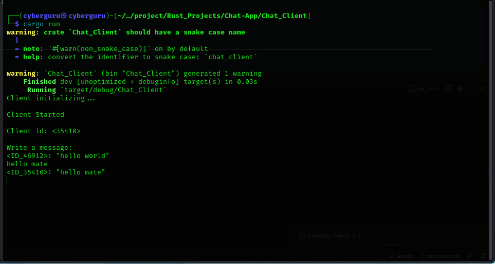

# CHAT_APP

Welcome to the `CHAT_APP` project! This project includes a chat server and a chat client written in Rust. The chat server handles multiple clients, broadcasting messages to all connected clients, while the chat client connects to the server, allowing users to send and receive messages in real-time using the client/server architecture chat system.

## Table of Contents

- [Overview](#overview)
- [Features](#features)
- [Installation](#installation)
- [Usage](#usage)
  - [Chat Server](#chat-server)
  - [Chat Client](#chat-client)
- [Screenshots](#screenshots)
- [Demo](#"Demo")
- [License](#license)

## Overview

`CHAT_APP` is designed to demonstrate a simple chat application architecture using Rust. It includes:

- A chat server that manages client connections and message broadcasting.
- A chat client that connects to the server and enables users to participate in chat sessions.

## Features

- **Multi-client support**: The chat server can handle multiple clients simultaneously.
- **Message broadcasting**: Messages from one client are broadcast to all connected clients.
- **Real-time communication**: Clients receive messages in real-time.

## Installation

### Prerequisites

Ensure you have Rust installed on your system. You can install Rust using [rustup](https://rustup.rs/).

### Clone the Repository

```bash
git clone https://github.com/Cyberguru1/Chat-App.git
cd Chat-App
```

```## Usage

### Chat Server

To start the chat server, run:

```bash
cd Chat_Server && cargo run --release --bin Chat_Server
```

Ensure to run the server first before running the clients...

The server will start and listen for incoming client connections on a specified port.

### Chat Client

To start a chat client, run:

```bash
cd Chat_Client && cargo run --release --bin Chat_Client
```

You will be prompted to enter the server address and port. After connecting, you can start sending and receiving messages.

## Screenshots

### Chat Server



### Chat Client

**Client_1**



**Client_2**



### **Video_Demo**


<video src="https://raw.githubusercontent.com/Cyberguru1/Chat-App/main/out.mp4" width="1500" />


## License

This project is licensed under the MIT License. See the [LICENSE](LICENSE) file for details.
